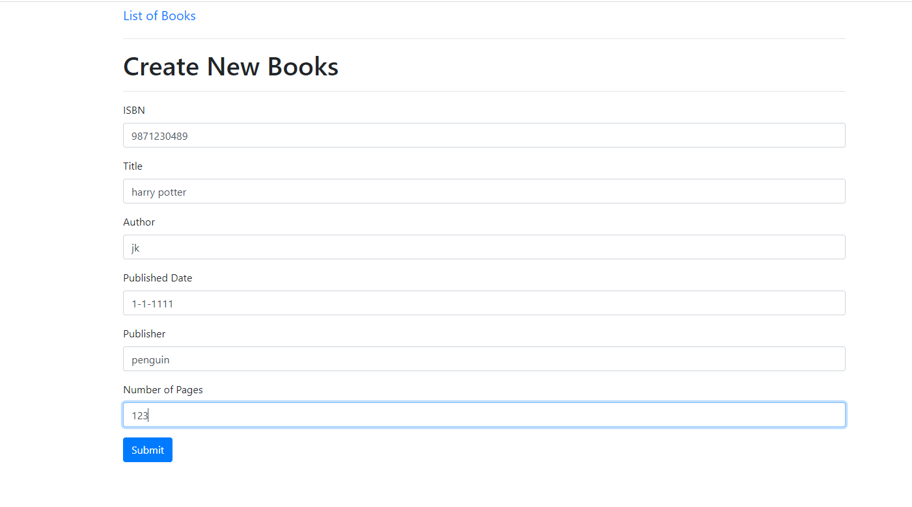
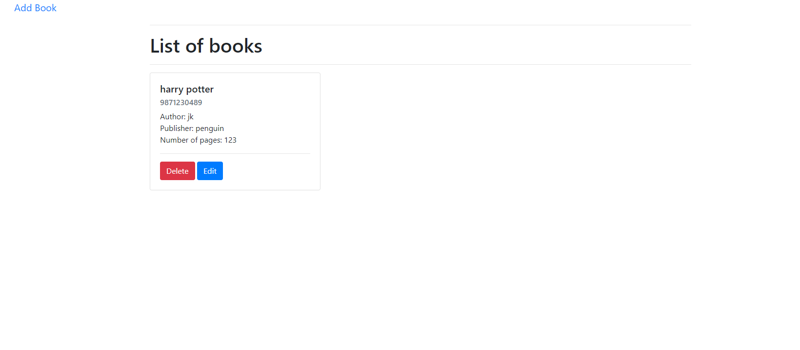

# Book Catalog
Lab 5 from my web development class. This lab had us practice making an API involving books by getting and sending information about the book.

## book-api.js
This is where the book API is implemented using express.js and CRUD operations. Here is where books will be added, deleted, or modified.

## book-list.js
This is where our book card is created whenever there is book data within the API. Using asynchronous functions, I implemented the functions that would be triggered based on what the user clicks on the web page. These functions handle the rendering of the book data from the API, the edit button, and deleting books.

## new-book.html
Here is where we add information about a book that we want to add into the catalog. We are able to use a simple and clean design by using Bootstrap.

## book-list.html
This is the web page where we can see what books are in the catalog. Here we have the implementation for the edit book button and its inputs. Bootstrap is also used here for a quick and simple design.

 

